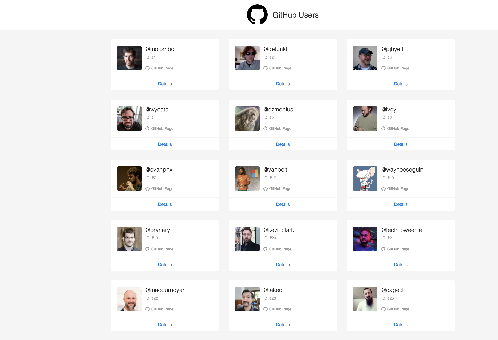
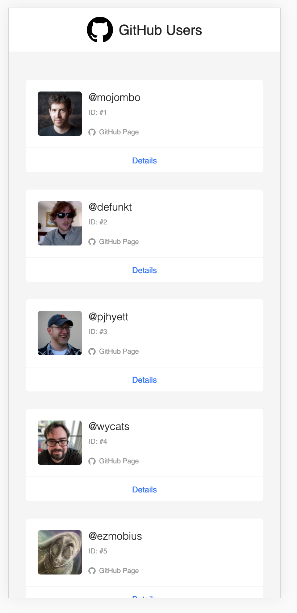
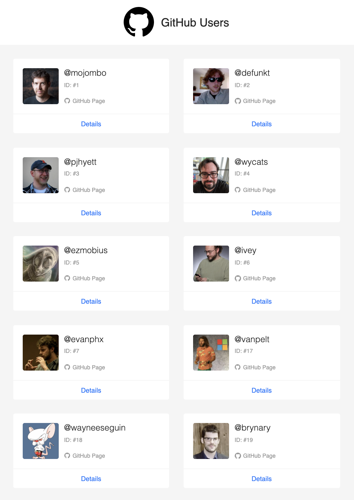

# GitHub Users App

This small project is built in order to practice using Redux-Toolkit with respect to the best practices and latest recommendations from redux style guide.

* React
* Redux
* Redux-observable
* RTK (redux-toolkit)
* Typescript
* REST API Github Users

## Available Scripts

## Demo on heroku: https://github-user-application.herokuapp.com/
In the project directory, you can run:

### `yarn start`

                        
